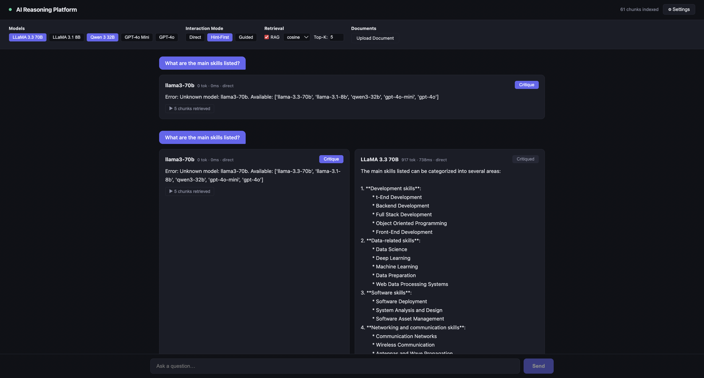
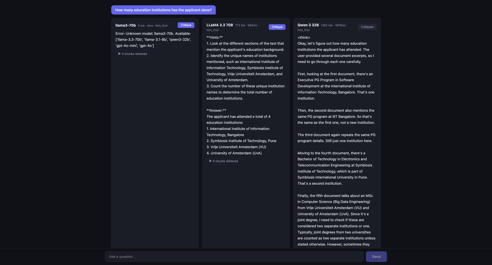

# Adaptive LLM Reasoning Platform

A full-stack multi-model LLM interaction platform for studying how different AI systems handle reasoning, retrieval-augmented generation, and structured interaction strategies. Built with FastAPI, React/TypeScript, and local embeddings.





## What This Does

This platform lets you upload any document, ask questions against it, and compare how different LLMs respond — side by side, in real time. It goes beyond simple chatbot interfaces by providing configurable retrieval strategies, multiple interaction modes, and an automated critique engine that scores every response for correctness, groundedness, and completeness.

The goal is not just to get answers, but to study *how* different models reason, where they hallucinate, how retrieval context affects response quality, and what happens when you change the interaction structure from direct Q&A to guided reasoning.

## Core Features

### Multi-Model Comparison
Query multiple LLMs simultaneously and see their responses side by side. Currently supports LLaMA 3.3 70B, LLaMA 3.1 8B, Qwen 3 32B (via Groq, free), and GPT-4o / GPT-4o Mini (via OpenAI). Adding a new model takes one config entry.

### Retrieval-Augmented Generation (RAG)
Documents are chunked semantically, embedded locally using sentence-transformers (all-MiniLM-L6-v2), and stored in a lightweight JSONL vector store. At query time, the platform retrieves the most relevant chunks using configurable similarity metrics (cosine, L2, dot product) with adjustable Top-K. Every retrieved chunk is inspectable — you can see exactly what context each model received, with relevance scores.

### Interaction Modes
Three distinct prompting strategies that change how the model structures its response:
- **Direct**: Standard question-answer generation
- **Hint-First**: Model provides hints before revealing the full answer, encouraging the reader to reason first
- **Guided Reasoning**: Step-by-step breakdown with sub-questions, evidence synthesis, and confidence ratings

Same question, same context, different interaction mode — the quality and structure of responses changes measurably.

### Critique Engine
Every response can be evaluated through a multi-dimensional critique pipeline that scores:
- **Correctness**: Is the response factually accurate given the context?
- **Groundedness**: Does it stick to retrieved information or hallucinate?
- **Completeness**: Does it address all aspects of the question?

The critique also identifies specific issues (hallucinations, misinterpretations, omissions) and suggests improvements.

### Interaction Logging
Every query, response, retrieval result, and critique is logged in JSONL format per session for later analysis.

## Technical Architecture

```
┌─────────────────────────────────────────────────────────┐
│                    React / TypeScript                     │
│         Chat UI · Model Comparison · Chunk Inspector      │
│              Critique Panel · Settings Controls            │
└──────────────────────────┬──────────────────────────────┘
                           │ HTTP / REST
┌──────────────────────────┴──────────────────────────────┐
│                      FastAPI Backend                      │
│                                                           │
│  ┌─────────────┐  ┌──────────────┐  ┌────────────────┐  │
│  │ Model Router │  │ RAG Pipeline │  │ Critique Engine │  │
│  │ Groq API    │  │ Chunking     │  │ LLM-as-Judge   │  │
│  │ OpenAI API  │  │ Embedding    │  │ Structured     │  │
│  │ Async calls │  │ Vector Store │  │ Scoring        │  │
│  └─────────────┘  └──────────────┘  └────────────────┘  │
│                                                           │
│  ┌──────────────────┐  ┌─────────────────────────────┐   │
│  │ Interaction Modes │  │ JSONL Logger                │   │
│  │ Direct / Hint /   │  │ Sessions · Events · Metrics │   │
│  │ Guided Reasoning  │  └─────────────────────────────┘   │
│  └──────────────────┘                                     │
└───────────────────────────────────────────────────────────┘
```

### Tech Stack

**Backend**: Python, FastAPI, httpx, Pydantic, sentence-transformers, PyMuPDF, NumPy

**Frontend**: React, TypeScript, Vite

**Embeddings**: all-MiniLM-L6-v2 (local, no API calls — runs on CPU)

**LLM Providers**: Groq (LLaMA, Qwen — free tier), OpenAI (GPT models)

**Infrastructure**: Docker, Docker Compose, NGINX-ready

### Key Design Decisions

- **Local embeddings over API-based**: Using sentence-transformers locally eliminates embedding API costs and rate limits entirely. The all-MiniLM-L6-v2 model is ~90MB and runs fast on CPU.
- **JSONL vector store over ChromaDB/FAISS**: Fully inspectable, no binary dependencies, trivially portable.
- **OpenAI-compatible API format**: Both Groq and OpenAI use the same request format, so adding any compatible provider is a one-line config change.
- **Prompt-based interaction modes**: The three modes are implemented as system prompt templates, not separate code paths.

## Getting Started

### Prerequisites

- Python 3.11+
- Node.js 18+
- API key from [Groq](https://console.groq.com) (free) and/or [OpenAI](https://platform.openai.com)

### 1. Backend Setup

```bash
cd backend
python -m venv venv
source venv/bin/activate       # Windows: venv\Scripts\activate
pip install -r requirements.txt

cp .env.example .env
# Edit .env and add your actual API keys

uvicorn app.main:app --reload --port 8000
```

The first document upload will download the embedding model (~90MB, one-time).

### 2. Frontend Setup

```bash
cd frontend
npm install
npm run dev
```

Open [http://localhost:5173](http://localhost:5173)

### 3. Using the Platform

1. Click **Settings** in the top right
2. Select one or more models (Groq models are free)
3. Click **Upload Document** and select a PDF, TXT, or MD file
4. Choose an interaction mode and retrieval settings
5. Type a question and hit **Send**
6. Click **Critique** on any response to get evaluation scores

### Docker

```bash
cp backend/.env.example backend/.env
# Fill in your API keys
docker-compose up --build
```

## What You Can Study With This

**Model behavior differences**: Same question, same context — how does LLaMA 3.3 70B compare to Qwen 3 32B? Where do they diverge? Which hallucinates more on technical content?

**Interaction mode effects**: Does hint-first prompting produce more grounded answers than direct response? Does guided reasoning improve completeness scores?

**Retrieval sensitivity**: How does changing the similarity metric affect which chunks get retrieved? Does Top-K=3 vs Top-K=10 change answer quality?

**Critique consistency**: Does the critique engine score the same response consistently across runs?

## Project Structure

```
backend/
  app/
    routes/          # API endpoints: chat, models, documents, critique, insights
    services/        # LLM provider, vector store, ingestion, critique, insights, logger
    models/          # Pydantic request/response schemas
    config.py        # Model configurations, interaction mode prompts
  data/              # Vector store, interaction logs, uploaded documents

frontend/
  src/
    App.tsx          # Full UI: chat, comparison, chunk inspector, critique, settings
```

## Extending

**Add a new model**: Add a `ModelConfig` entry in `backend/app/config.py`.

**Add a new interaction mode**: Add an entry to `INTERACTION_MODES` in `config.py`.

**Swap the vector store**: Replace `vector_store.py` with a ChromaDB or FAISS implementation.

## License

MIT
